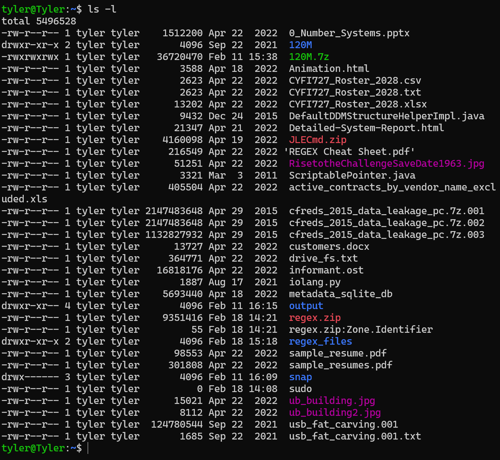
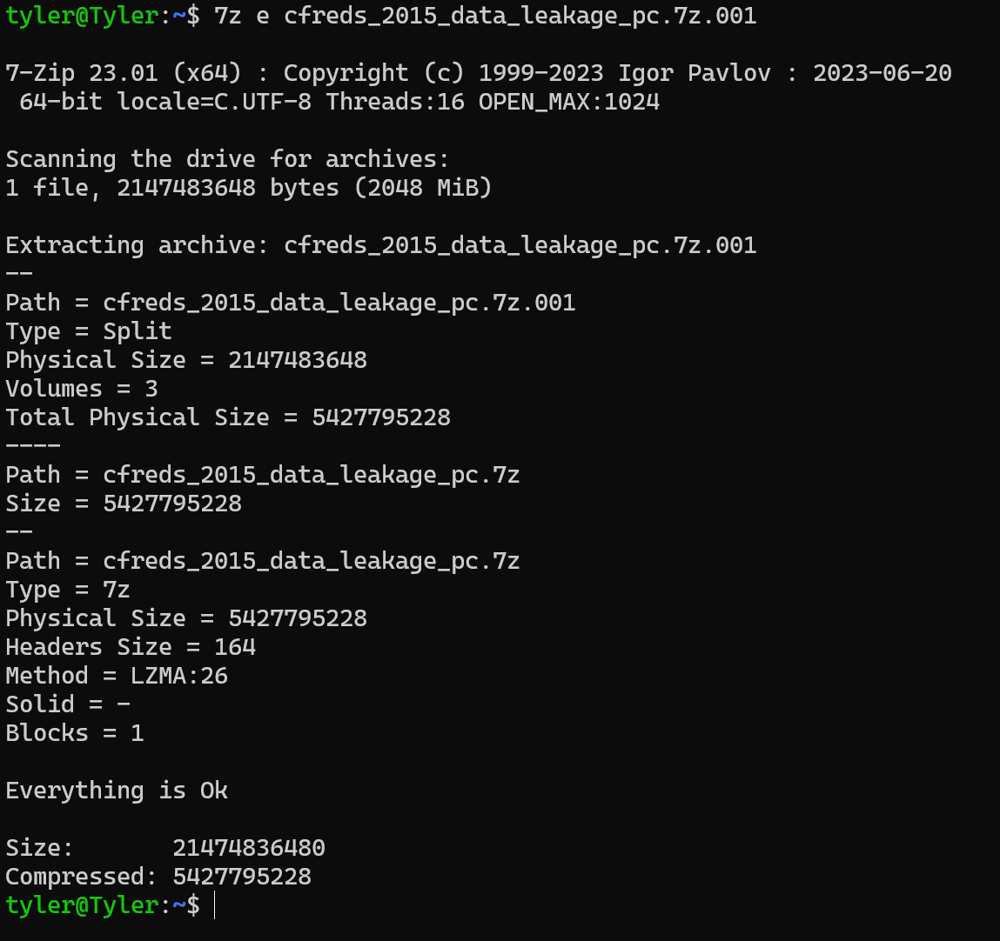
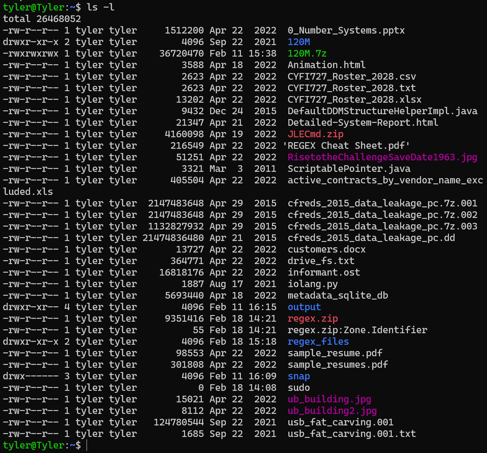
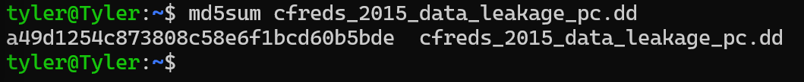
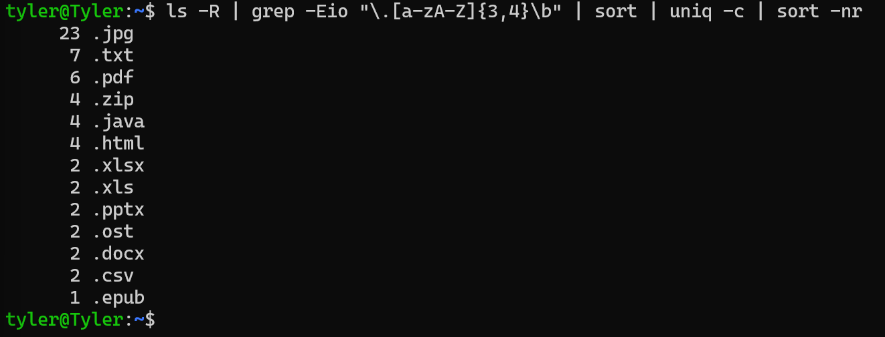
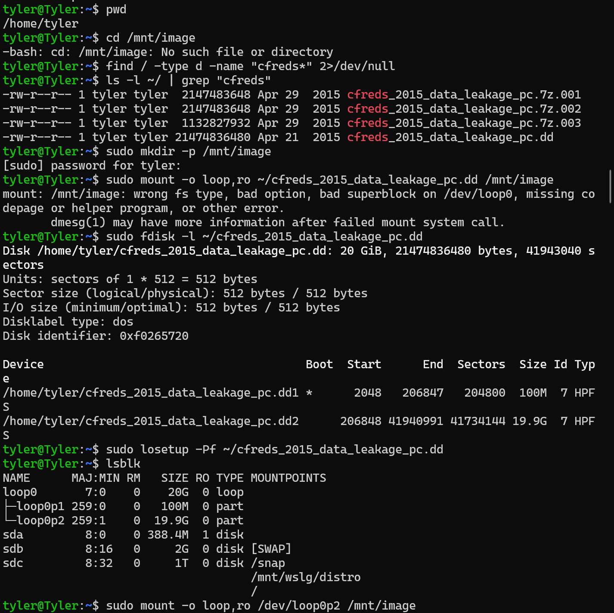
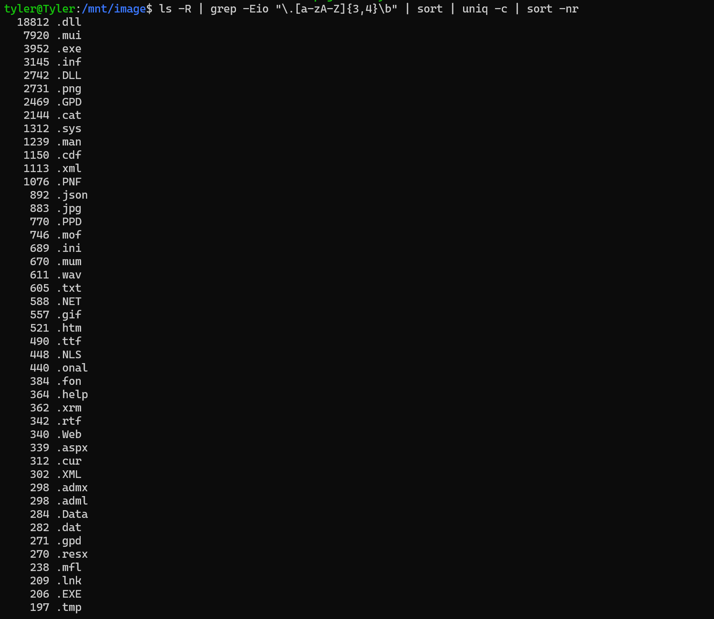
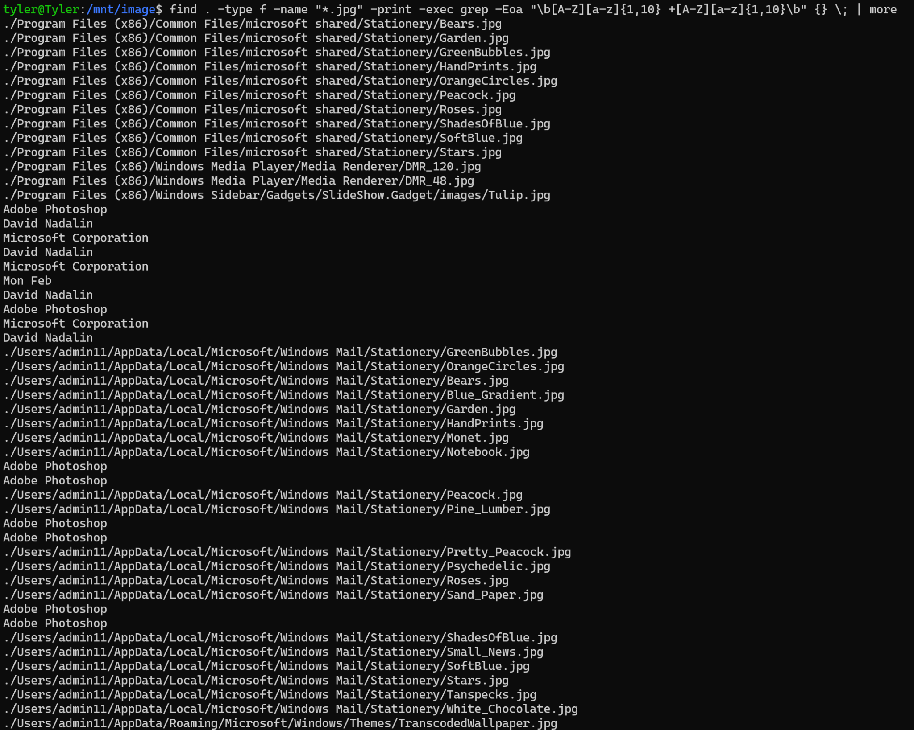
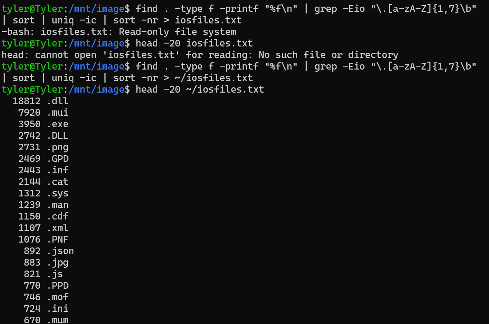

# Metadata and Content Analysis of Digital FIles Using Forensic Techniques

**Searching data leakage image**

-   Download DD image from

    -   https://cfreds-archive.nist.gov/data_leakage_case/images/pc/cfreds_2015_data_leakage_pc.7z.001

    -   https://cfreds-archive.nist.gov/data_leakage_case/images/pc/cfreds_2015_data_leakage_pc.7z.002

    -   https://cfreds-archive.nist.gov/data_leakage_case/images/pc/cfreds_2015_data_leakage_pc.7z.00

    -   Via wget

-   

-   Verify files

-   

    -   Lets unzip one of the files

-   

    -   Confirm the unzipped file

-   

    -   Confirm the unzipped file via md5sum

-   

    -   ls -R → Lists all files recursively.

    -   grep -Eio \"\\.\[a-zA-Z\]{3,4}\\b\" → Extracts file extensions
        (3-4 characters long).

    -   -E → Enables extended regex.

    -   -i → Ignores case sensitivity.

    -   -o → Outputs only matching parts.

    -   sort → Sorts file extensions alphabetically.

    -   uniq -c → Counts unique occurrences.

    -   sort -nr → Sorts by frequency (descending).

-   I expected more files to show up

-   Had to mount the correct partition

-   

    -   Cd into the new directory

    -   Ran same command again and it gave me all the files i was
        expecting

    -   

-   

    -   find . -type f -name \"\*.jpg\" -print -exec grep -Eoa
        \"\\b\[A-Z\]\[a-z\]{1,10} +\[A-Z\]\[a-z\]{1,10}\\b\" {} \\; \|
        more

        -   find . -type f -name \"\*.jpg\" → Finds all .jpg files
            recursively.

        -   -print → Prints the file paths.

        -   -exec grep -Eoa \"\\b\[A-Z\]\[a-z\]{1,10}
            +\[A-Z\]\[a-z\]{1,10}\\b\" {} \\; → Extracts potential names
            inside .jpg files.

        -   -E → Enables extended regex.

        -   -o → Outputs only matching text.

        -   -a → Treats binary files as text.

        -   \\b\[A-Z\]\[a-z\]{1,10} +\[A-Z\]\[a-z\]{1,10}\\b → Matches
            capitalized first and last names (e.g., \"John Doe\").

        -   \| more → Paginates output so you can scroll.

-   

    -   Found all files and extracted 1-7 character file extensions and
        counts occurrences and saved the output to iosfiles.txt

    -   Ran into the problem of the directory only being read only

    -   Changed directory to home

**Summary**

In this lab, I analyzed a forensic disk image to investigate potential
data leakage. I started by downloading and verifying the image, then
extracted and mounted the correct partition to access its full contents.
Using file search techniques, I identified and categorized different
file types, extracted metadata from images, and searched for potential
names within .jpg files. When I encountered a read-only file system
issue, I resolved it by redirecting output to my home directory. By the
end of the lab, I successfully gathered and organized forensic data for
further analysis.
